# Active Directory Lab

Windows Server 2019 domain controller built in VirtualBox, with a Windows 10 client joined to the domain. Built by following Josh Madakor's Active Directory home lab tutorial. The user creation script is adapted from his repository.

## Setup

- DC: Windows Server 2019 running AD DS, DNS, DHCP, and RAS/NAT, with two network adapters: NAT for internet access and an internal network for the lab.
- CLIENT1: Windows 10 Pro on the internal network.
- Domain: mydomain.com

## Network

| Machine | Adapter        | IP address             |
|---------|----------------|------------------------|
| DC      | Internet (NAT) | Assigned by VirtualBox |
| DC      | Internal       | 172.16.0.1 (static)    |
| CLIENT1 | Internal       | 172.16.0.100 to .200 range (DHCP from DC) |

## Build steps

### 1. Domain controller networking
Set up the DC with two adapters: Adapter 1 on NAT for internet access and Adapter 2 on an internal network for the lab. Renamed them to internet and internal_net in Windows and gave the internal adapter a static IP of 172.16.0.1.

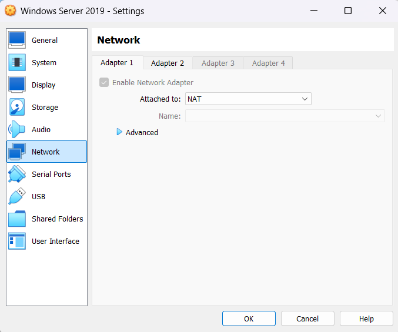

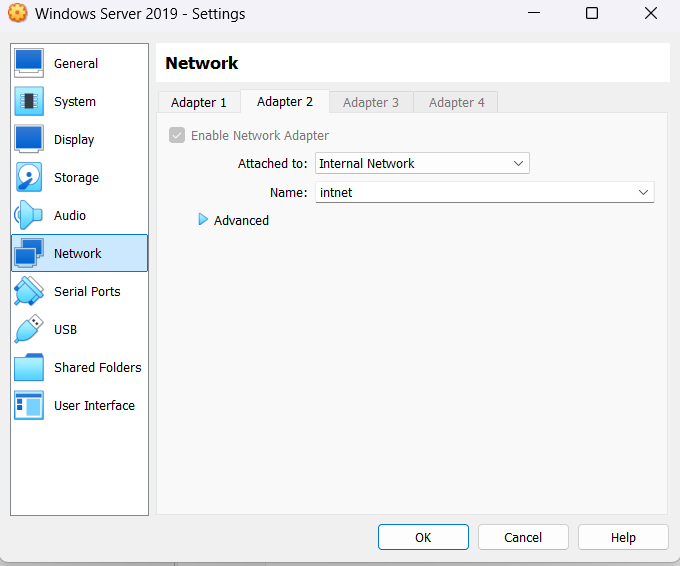

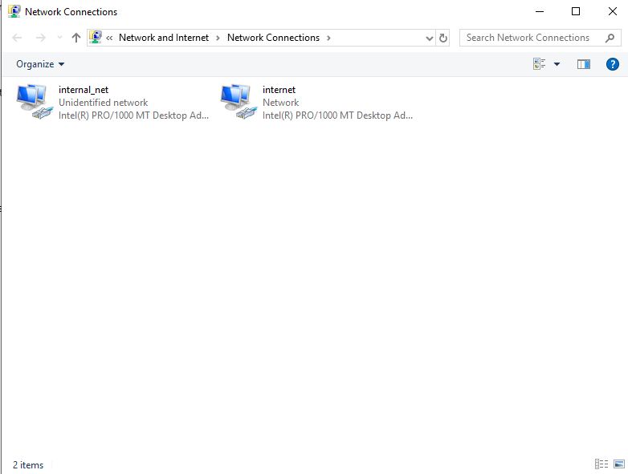

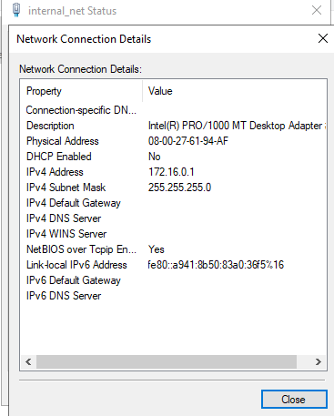

### 2. Active Directory Domain Services
Installed AD DS and promoted the server to a domain controller in a new forest. Created a separate admin account in its own OU and added it to Domain Admins.

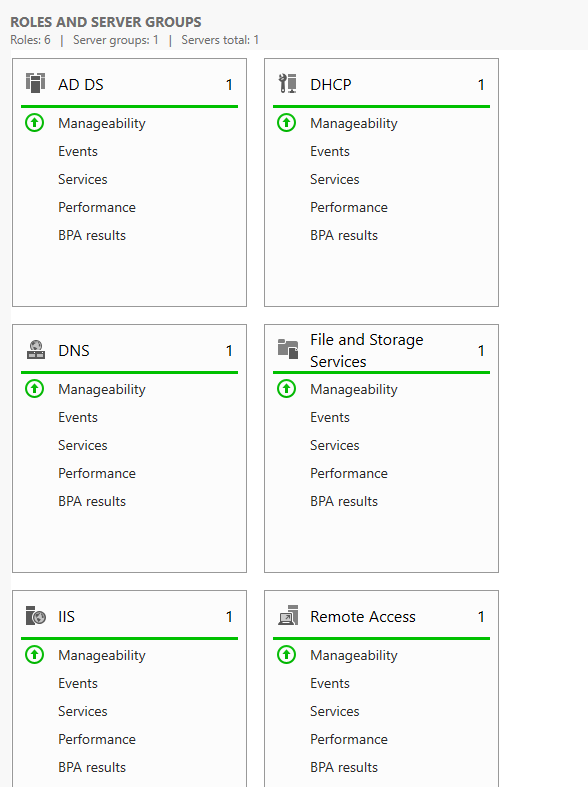

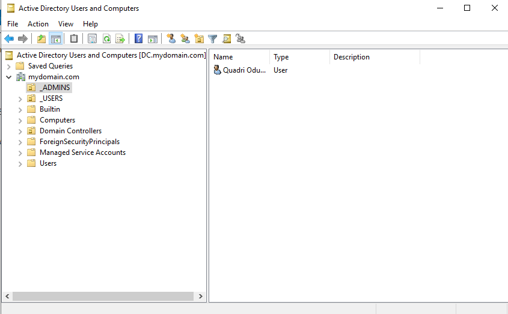

### 3. Routing and NAT
Configured RAS with NAT so machines on the internal network could reach the internet through the DC.

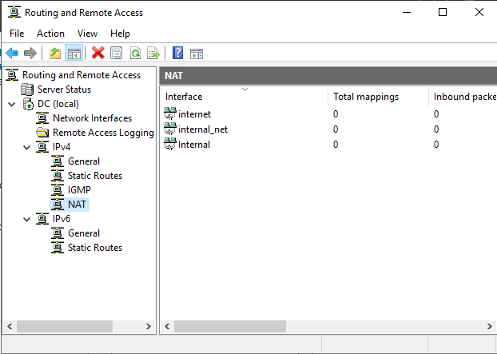

### 4. DHCP
Created a DHCP scope of 172.16.0.100 to 172.16.0.200 with the DC set as the default gateway. CLIENT1 received the first address in the range.

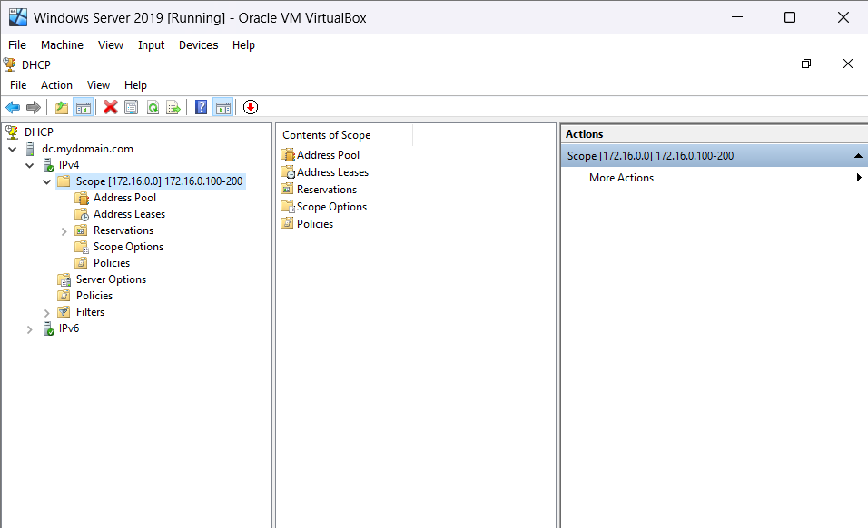

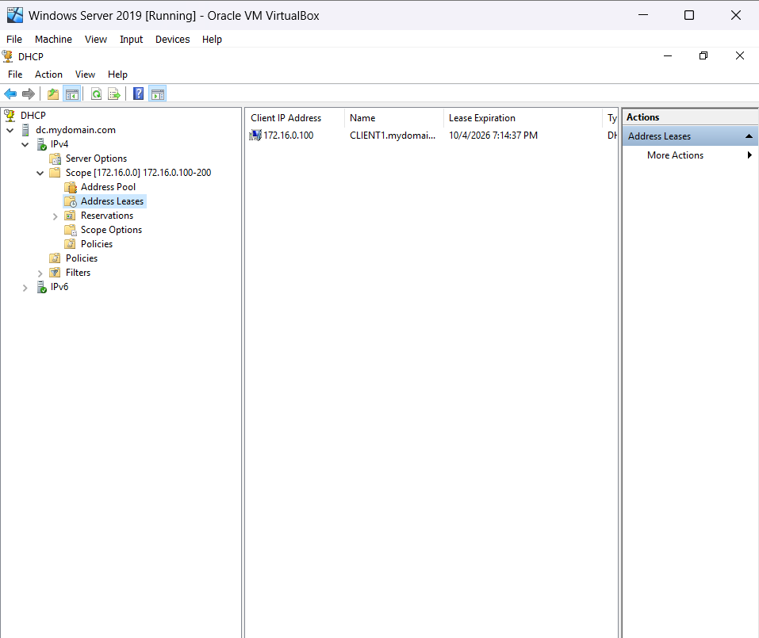

### 5. Bulk user creation
Ran a PowerShell script that created 1,000 user accounts from a list of names.

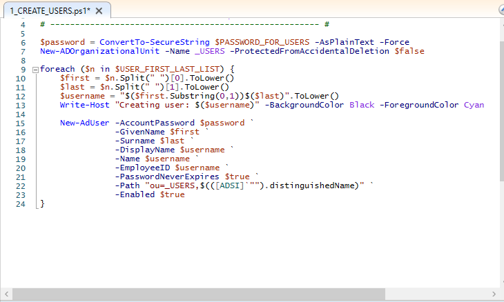

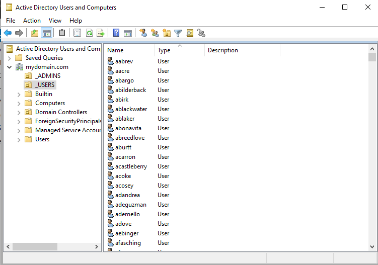

### 6. Client setup
Joined CLIENT1 to the domain and logged in with one of the generated accounts. The ipconfig output confirms the client received its address, gateway, and DNS from the DC.

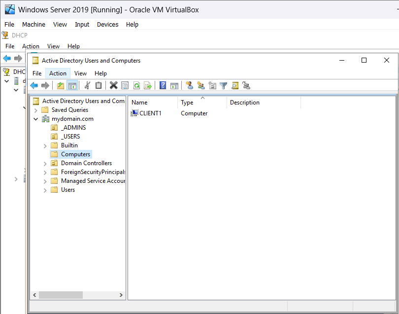

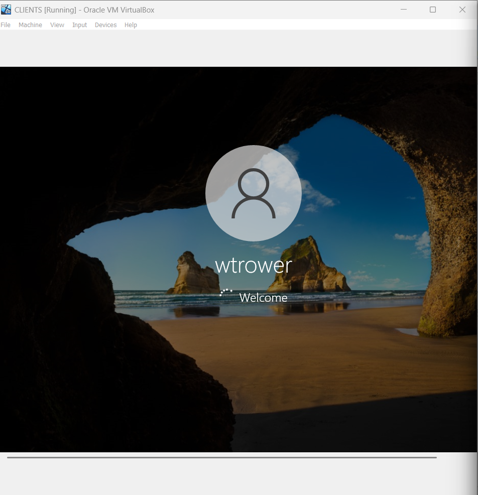

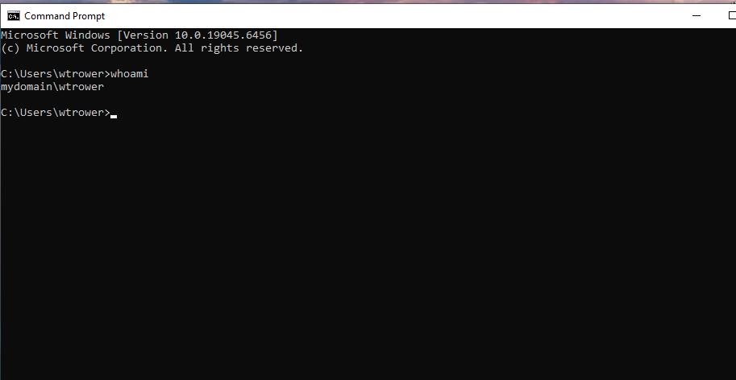

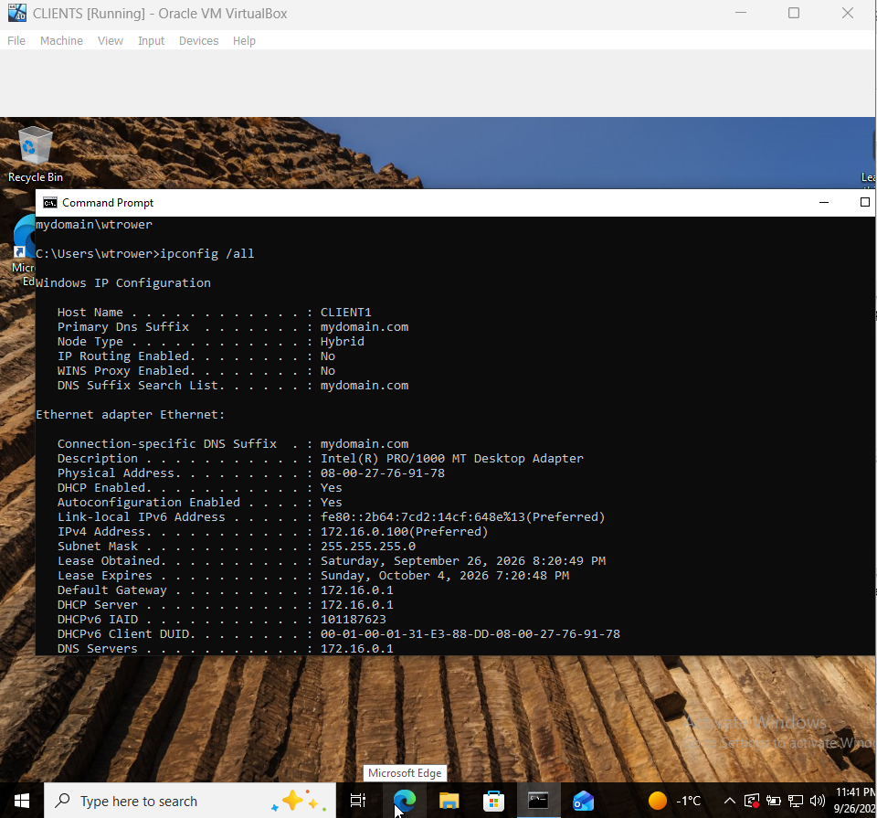
